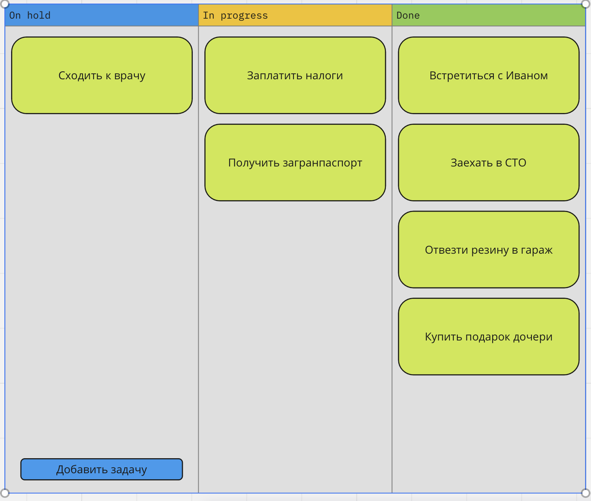

# task-tracker

Учебный проект курса
[Kotlin Backend Developer](https://otus.ru/lessons/kotlin/?int_source=courses_catalog&int_term=programming).
Поток курса 2023-06.

**task-tracker** - приложение для ведения списка дел, отслеживания статуса их выполнения.
Задача трекера предоставить инструмент продуктивности, который помогает организовать жизнь и работу.
Фиксируйте задачи, планируйте свой день.

## Визуальная схема фронтенда

## Документация

1. Маркетинг
   1. [Заинтересанты](./docs/marketing/01-stakeholders.md)
   2. [Целевая аудитория](./docs/marketing/02-target-audience.md)
   3. [Конкурентный анализ](./docs/marketing/03-concurrency.md)
   4. [Анализ экономики](./docs/marketing/04-economy.md)
   5. [Пользовательские истории](./docs/marketing/05-user-stories.md)
2. Архитектура
   1. [Описание API](./docs/architecture/03-api.md)